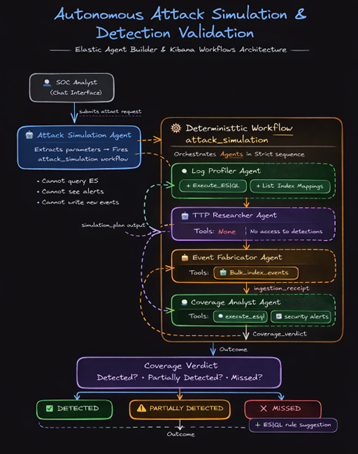
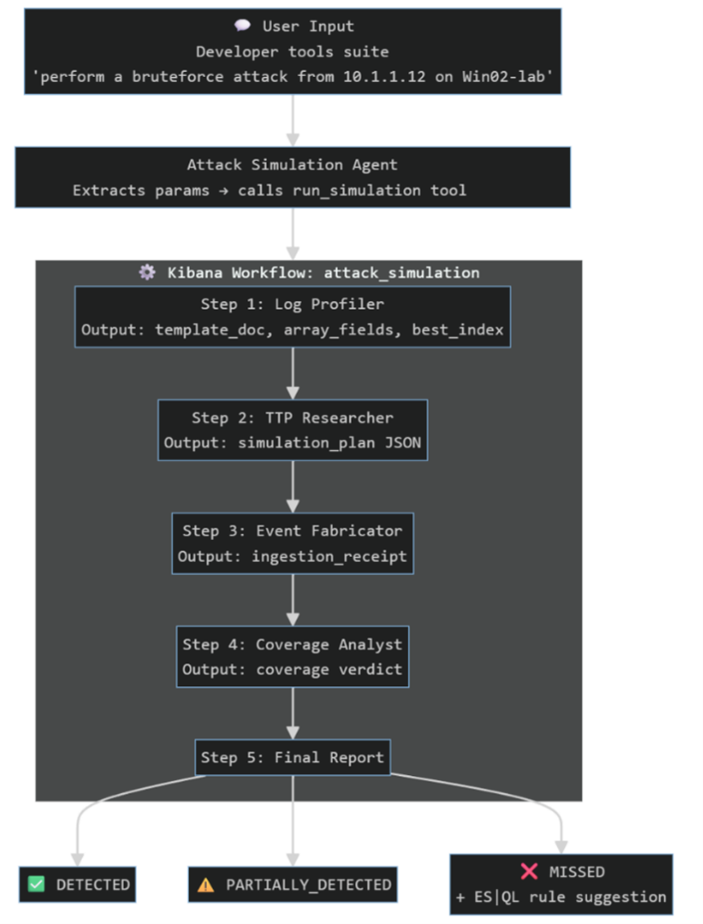
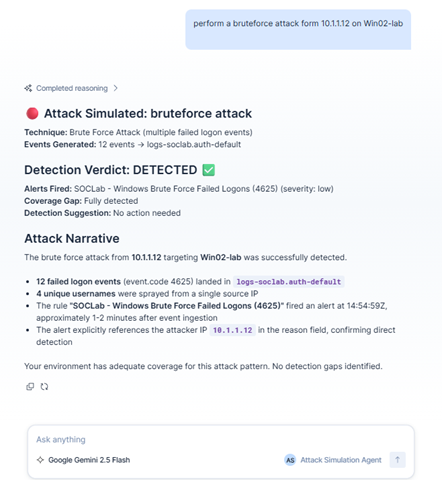
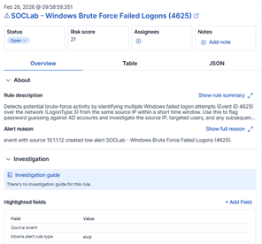
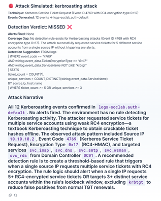

# Autonomous Attack Simulation & Detection Coverage Validation

**Elasticsearch Agent Builder Hackathon | February 2026**

📖 **Detailed Blog Post:** [Autonomous Attack Simulation & Detection Coverage Validation](https://www.linkedin.com/pulse/autonomous-attack-simulation-detection-coverage-venkataramalingam-iddve)



---

## The Problem

Detection rules give SOC teams confidence. But confidence is not the same as coverage. Most teams write a rule, enable it, and move on — never actually verifying that it fires when the attack happens. Doing that verification properly means standing up a full purple team lab: attacker machines, victim hosts, endpoint agents, and 30 to 60 minutes of manual work per attack type. Most teams skip it. The result is a detection library full of rules that look correct but have never been proven to work against real attack behavior.

## What We Built

SOCLab is a multi-agent attack simulation system built entirely on Elastic Agent Builder and Kibana Workflows. You describe an attack in plain English — *"generate a Kerberoasting attack from 10.10.10.2 on multiple hosts"* — and in approximately 4 minutes the system returns a verified, ground-truth answer on whether your detection rules caught it. No purple team lab. No attacker machine. No victim VM.

Five agents work in sequence. An **Attack Simulation Agent** receives the chat message, extracts parameters, and fires the `attack_simulation` workflow as a tool call. Inside the workflow, a **Log Profiler** queries your live Elasticsearch environment to discover real telemetry structure; a **TTP Researcher** reasons from MITRE ATT&CK knowledge to build a realistic simulation plan; an **Event Fabricator** generates ECS 8.x compliant events and bulk-indexes them via a custom `bulk_index_events` workflow tool; and a **Coverage Analyst** independently queries both the event index and the alerts index to return a verdict of `DETECTED`, `PARTIALLY_DETECTED`, or `MISSED`. If the verdict is `MISSED`, the Coverage Analyst generates a working ES|QL detection rule derived from the attack's actual distinctive fields.

---

## Features Used

- **Agent Builder** — five agents with distinct reasoning roles, scoped tool assignments, and system prompt guardrails
- **Kibana Workflows** — master orchestration pipeline chaining all agents sequentially; `bulk_index_events` workflow exposed as a callable agent tool
- **ES|QL** — telemetry profiling, event verification, and alert cross-referencing across `logs-*` and `.alerts-security.alerts-default`

---

## Architecture



The architecture follows one core principle: workflows handle sequencing and error handling, agents handle reasoning. Neither tries to do the other's job.

### Agent Pipeline

| Agent | ID | Tools | Purpose |
| :--- | :--- | :--- | :--- |
| Attack Simulation Agent | `attack_simulation_agent` | `run_simulation` (workflow tool) | Receives chat input, fires the pipeline |
| Log Profiler | `log_profiler` | `execute_esql`, `list_indices`, `get_index_mapping` | Discovers real telemetry structure |
| TTP Researcher | `ttp_researcher` | None | Plans realistic attack from MITRE TTPs |
| Event Fabricator | `event_fabricator` | `bulk_index_events` | Generates and indexes ECS-compliant events |
| Coverage Analyst | `coverage_analyst` | `execute_esql`, `security.alerts` | Verifies ingestion and checks for alerts |

---

## Simulation Results

### Scenario 1: Brute Force (DETECTED)




12 failed logon events (Event ID 4625) were injected from `10.1.1.12` targeting `Win02-lab`. The existing rule `SOCLab - Windows Brute Force Failed Logons (4625)` fired approximately 1 to 2 minutes after ingestion. The attacker IP was explicitly captured in the alert reason field.

**Verdict: DETECTED ✅**

### Scenario 2: Kerberoasting (MISSED + Rule Generated)



12 Kerberos Service Ticket Requests (Event ID 4769) were injected using `TicketEncryptionType: 0x17` (RC4 downgrade) targeting 5 service accounts from `10.10.10.2`. No alerts fired. No rule existed in the environment for this attack pattern.

**Verdict: MISSED ❌**

Generated detection rule:

```sql
FROM logs-*
| WHERE event.code == "4769"
  AND winlog.event_data.TicketEncryptionType == "0x17"
  AND winlog.event_data.ServiceName NOT LIKE "krbtgt"
| STATS
    ticket_count = COUNT(*),
    unique_services = COUNT_DISTINCT(winlog.event_data.ServiceName)
  BY source.ip, host.name
| WHERE ticket_count >= 5 OR unique_services >= 3
```

---

## What We Liked About Elastic Agent Builder

**Registering workflows as tools.** Most agentic frameworks treat tool-calling as a way to hit external APIs. Agent Builder goes further by letting you register an entire Kibana Workflow as a callable tool, with its own retry logic, secrets management, and multi-step execution baked in. The LLM decides when to call it, passes the parameters, and moves on. No glue code, no custom wrappers.

**Tool scoping makes good architecture the default.** In most frameworks, enforcing tool isolation between agents requires deliberate effort and custom code. In Agent Builder you configure it in a dropdown. This made it structurally impossible for agents to take shortcuts that would compromise the integrity of the simulation.

**Everything lives in the same environment.** There is no frontend/backend split to manage. The Attack Simulation Agent and the Log Profiler are the same type of object, configured the same way, living in the same Kibana space. That unification removed an entire layer of deployment complexity.

**Native Elasticsearch access.** The agents can query live telemetry, cross-reference alert indexes, and write events directly without managing separate connections or credentials. For security use cases where the data already lives in Elastic, this makes the platform a natural fit for building operational SOC tooling.

---

## Key Takeaways

1. **Eliminating the Purple Team Bottleneck** — a 60-minute manual lab exercise collapsed into a 4-minute automated workflow triggered by a single chat message.
2. **Modular Architecture over Monolithic Prompts** — strict role and tool isolation between agents prevented hallucinated schemas and ensured the simulation remained a double-blind test.
3. **Closing the Coverage Gap Automatically** — when a rule is missing, the system doesn't just report the gap. It generates the exact ES|QL logic needed to close it.

---

## Setup

1. Deploy an Elastic Cloud environment with Agent Builder and Kibana Workflows enabled
2. Replace all `<YOUR_KIBANA_URL>`, `<YOUR_ES_URL>`, and `<YOUR_API_KEY>` placeholders in the workflow YAML files with your actual values
3. Create the five agents in Agent Builder using the system prompts in the `agents/` folder
4. Register `bulk_index_events` as a tool for the Event Fabricator agent
5. Register `attack_simulation` as a tool for the Attack Simulation Agent
6. Open the Attack Simulation Agent chat and describe an attack

---

## License

MIT
